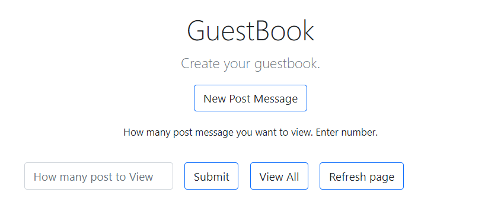
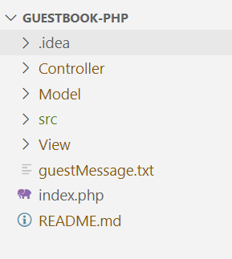
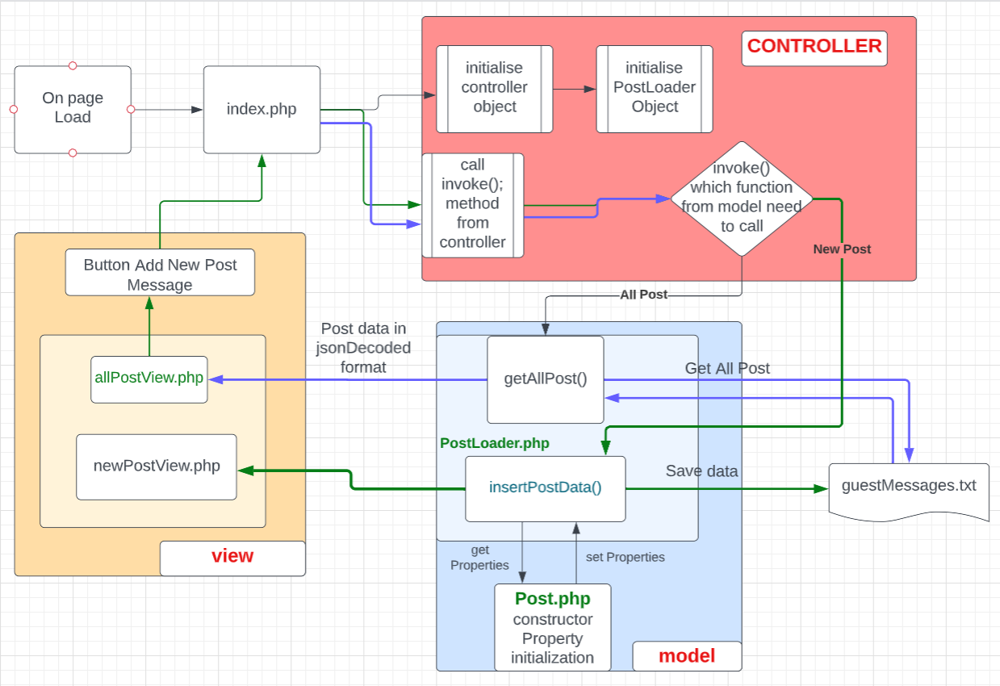

# guestbook-php
Create a guestbook using php concepts of oop and MVC

## Learning objectives
- Storing data in files
- Converting complex constructs (array/objects) to string representation.

## Mission
- Any visitor on te page can leave a message on your page which will be saved to a text file.(using file_get_content, file_pu_content and json_encode, json_decode)
- Display all the message to the page with the latest mesage first.

## Requirements
  To implement a guestbook my requirements are : 
  1. User **Post** entries data like (**user name, Post message title, Post message, Post entry date**)
  2. A **form** through which I can receive data above data from user.
  3. Need some buttons 
     1. New Post Message : Redirect user to add new post message
     2. A text file (guestMessage.txt) to save these messages to it.
     3. View All Post : Display all available post messages
  4. Add a form for accept number of post user want to display.
     

## Implementation 
 1. I want to make this project using MVC, so in the beginning my folder structure will be,

     
   The Src folder will have images used for the project 
 2. I create multiple view files and access them through controller as per the conditions.
 3. The general description of flow and files code.
    1. CONTROLLER :
       1. A controller method **invoke()** called by **index.php**,  call or load a view as per user requirements or inputs.
       2. Like to display all post it call **getAllPosts()** method from Model and load the returned data to index file by loading **allPostView.php** view.
    2. MODEL : 
       1. Define **Post.php** file, this file contains the properties about post as ($firstName,$surname,$title,$message,$image,$date) and has getter methods to get values of these properties. (this file considers as a database table structure)
       2. Define another model file **PostLoader.php**, this file includes Post.php file and have methods (insertPostData(), getAllPosts()). 
          - insertPostData() : collect data from controller and do some operation on it and save it to **guestMessage.txt** file using **file_put_contents** and **json_encode**.
          - getAllPosts() : collect data from **guestMessage.txt** file using **file_get_contents** and **json_decode** and send it to controller.
    3. VIEW : 
       1. allPostView.php : Used to display all available post messages from guestBook.txt file also add **New Post** button (on click user redirects to newPostView)
       2. newPostView.php : Add Post Message insert data form and on submit it sends data to controller and from controller to model and text file.
    4. Below is basic flow of the guestbook, 
    
    5. Also, added emoji's and replace bad words with asterisk '*' and form to allPostView.php page to allow user to view specific number of post.